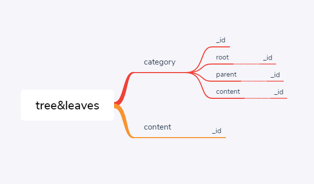
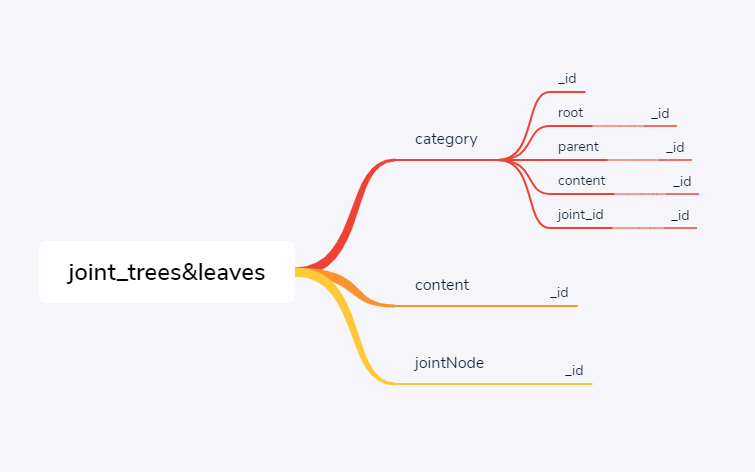

# trees&leaves

A storage structure designed for tree-structured data and **complex node relations**.

# bascic
It can be used in scenarios such as catalogue, organizational structure, classification, etc.

## How to Store Complex Node Relations

It adds a new form. Is it well designed?

It **avoided circular references**, didn't it? In this way, the original structure can always be maintained as a simple tree.

## What databases are supported

This is a design pattern that does not restrict the database.

Index.ts gives a calculation method of building tree in design mode.
